# Sơ đồ Use Case — Hệ thống E-learning Toán Lớp 3

## Actors

| Actor | Mô tả |
|---|---|
| **Giáo viên** | Quản trị nội dung, lớp học, bài thi, theo dõi học sinh |
| **Học sinh** | Làm bài thi, xem kết quả và tiến trình học tập |

---

## Sơ đồ PlantUML

> Render tại: https://www.plantuml.com/plantuml/uml/

```plantuml
@startuml
left to right direction
skinparam packageStyle rectangle
skinparam actorStyle awesome
skinparam usecase {
  BackgroundColor White
  BorderColor #5C6BC0
  ArrowColor #5C6BC0
}
skinparam actor {
  BorderColor #5C6BC0
}

actor "Giáo viên" as GV #LightBlue
actor "Học sinh"  as HS #LightGreen

' ════════════════════════════════════════════
rectangle "Hệ thống E-learning Toán Lớp 3" {

  ' ── Dùng chung ──────────────────────────
  package "Xác thực" {
    usecase "Đăng nhập"    as UC_LOGIN
    usecase "Đăng xuất"    as UC_LOGOUT
    usecase "Đổi mật khẩu" as UC_PWD
  }

  ' ── Giáo viên ───────────────────────────
  package "Dashboard & AI" {
    usecase "Xem thống kê tổng quan"  as UC_DASH
    usecase "Nhận lời khuyên từ AI"   as UC_AI
  }

  package "Quản lý lớp học" {
    usecase "Tạo / Sửa / Xóa lớp học"        as UC_CLASS_CRUD
    usecase "Thêm học sinh vào lớp"           as UC_ADD_STU
    usecase "Import học sinh từ Excel"        as UC_IMPORT_STU
    usecase "Xóa học sinh khỏi lớp"          as UC_DEL_STU
    usecase "Tìm kiếm học sinh"               as UC_SEARCH_STU
    usecase "Xem kết quả học sinh"            as UC_STU_RESULT
    usecase "Xem tiến trình học sinh (chart)" as UC_STU_PROG
    usecase "Nhận xét bài làm học sinh"       as UC_COMMENT
  }

  package "Quản lý bài học" {
    usecase "Tạo / Sửa / Xóa bài học" as UC_LESSON_CRUD
  }

  package "Quản lý bài thi" {
    usecase "Tạo / Sửa / Xóa bài thi"      as UC_EXAM_CRUD
    usecase "Sao chép bài thi"              as UC_CLONE
    usecase "Tạo câu hỏi bằng AI"          as UC_AI_Q
    usecase "Import câu hỏi từ Excel"       as UC_IMPORT_Q
    usecase "Giao bài thi cho lớp"          as UC_ASSIGN
    usecase "Hủy giao bài thi"              as UC_UNASSIGN
    usecase "Xem thống kê bài thi"          as UC_STATS
    usecase "Xuất kết quả bài thi (Excel)"  as UC_EXPORT_XLS
    usecase "Xuất đề thi (PDF)"             as UC_EXPORT_PDF
  }

  package "Ngân hàng câu hỏi" {
    usecase "Thêm / Sửa / Xóa câu hỏi"       as UC_QB_CRUD
    usecase "Import câu hỏi từ Excel"         as UC_QB_IMPORT
    usecase "Tải file mẫu Excel"              as UC_QB_SAMPLE
    usecase "Tìm kiếm câu hỏi"               as UC_QB_SEARCH
    usecase "Dùng câu hỏi từ ngân hàng\nvào bài thi" as UC_QB_PICK
  }

  ' ── Học sinh ────────────────────────────
  package "Học tập" {
    usecase "Xem danh sách bài thi được giao" as UC_LIST_EXAM
    usecase "Làm bài thi"                     as UC_DO_EXAM
    usecase "Xem kết quả bài thi"             as UC_VIEW_RESULT
    usecase "Xem nhận xét của giáo viên"      as UC_VIEW_COMMENT
    usecase "Xem tiến trình học tập"          as UC_MY_PROG
  }
}

' ════════════════════════════════════════════
' Giáo viên — liên kết
GV --> UC_LOGIN
GV --> UC_LOGOUT
GV --> UC_PWD
GV --> UC_DASH
GV --> UC_AI
GV --> UC_CLASS_CRUD
GV --> UC_ADD_STU
GV --> UC_IMPORT_STU
GV --> UC_DEL_STU
GV --> UC_SEARCH_STU
GV --> UC_STU_RESULT
GV --> UC_STU_PROG
GV --> UC_COMMENT
GV --> UC_LESSON_CRUD
GV --> UC_EXAM_CRUD
GV --> UC_CLONE
GV --> UC_AI_Q
GV --> UC_IMPORT_Q
GV --> UC_ASSIGN
GV --> UC_UNASSIGN
GV --> UC_STATS
GV --> UC_EXPORT_XLS
GV --> UC_EXPORT_PDF
GV --> UC_QB_CRUD
GV --> UC_QB_IMPORT
GV --> UC_QB_SAMPLE
GV --> UC_QB_SEARCH
GV --> UC_QB_PICK

' Học sinh — liên kết
HS --> UC_LOGIN
HS --> UC_LOGOUT
HS --> UC_PWD
HS --> UC_LIST_EXAM
HS --> UC_DO_EXAM
HS --> UC_VIEW_RESULT
HS --> UC_VIEW_COMMENT
HS --> UC_MY_PROG

' Quan hệ include / extend
UC_DASH       ..> UC_AI           : <<extend>>
UC_EXPORT_PDF ..> UC_EXAM_CRUD    : <<include>>
UC_AI_Q       ..> UC_EXAM_CRUD    : <<include>>
UC_IMPORT_Q   ..> UC_EXAM_CRUD    : <<include>>
UC_QB_PICK    ..> UC_EXAM_CRUD    : <<include>>
UC_VIEW_RESULT ..> UC_VIEW_COMMENT : <<extend>>
UC_MY_PROG    ..> UC_LIST_EXAM    : <<include>>

@enduml
```

---

## Danh sách Use Case theo Actor

### Giáo viên (27 use case)

#### Xác thực
| # | Use Case | Mô tả |
|---|---|---|
| UC01 | Đăng nhập | Đăng nhập bằng username + password |
| UC02 | Đăng xuất | Kết thúc phiên làm việc |
| UC03 | Đổi mật khẩu | Đổi mật khẩu qua sidebar |

#### Dashboard & AI
| # | Use Case | Mô tả |
|---|---|---|
| UC04 | Xem thống kê tổng quan | Số lớp, học sinh, bài thi, điểm trung bình |
| UC05 | Nhận lời khuyên từ AI | Gemini phân tích phân phối điểm → 3 lời khuyên giảng dạy |

#### Quản lý lớp học
| # | Use Case | Mô tả |
|---|---|---|
| UC06 | Tạo / Sửa / Xóa lớp học | CRUD lớp học |
| UC07 | Thêm học sinh vào lớp | Tìm và thêm học sinh có sẵn |
| UC08 | Import học sinh từ Excel | Tải lên file Excel để thêm hàng loạt |
| UC09 | Xóa học sinh khỏi lớp | Gỡ học sinh ra khỏi lớp |
| UC10 | Tìm kiếm học sinh | Tìm theo tên/username |
| UC11 | Xem kết quả học sinh | Danh sách điểm từng bài thi của học sinh |
| UC12 | Xem tiến trình học sinh | Biểu đồ đường điểm số theo thời gian |
| UC13 | Nhận xét bài làm học sinh | Giáo viên ghi nhận xét trên bài nộp |

#### Quản lý bài học
| # | Use Case | Mô tả |
|---|---|---|
| UC14 | Tạo / Sửa / Xóa bài học | CRUD bài học (tiêu đề, mô tả) |

#### Quản lý bài thi
| # | Use Case | Mô tả |
|---|---|---|
| UC15 | Tạo / Sửa / Xóa bài thi | CRUD bài thi trong bài học |
| UC16 | Sao chép bài thi | Clone toàn bộ câu hỏi + đáp án |
| UC17 | Tạo câu hỏi bằng AI | Gemini sinh câu hỏi trắc nghiệm từ tiêu đề bài học |
| UC18 | Import câu hỏi từ Excel | Upload file Excel → parse câu hỏi vào editor |
| UC19 | Giao bài thi cho lớp | Chọn lớp, đặt deadline và thời gian làm bài |
| UC20 | Hủy giao bài thi | Gỡ bài thi khỏi lớp |
| UC21 | Xem thống kê bài thi | Phân phối điểm, tỉ lệ đúng từng câu |
| UC22 | Xuất kết quả bài thi (Excel) | Tải file Excel toàn bộ kết quả |
| UC23 | Xuất đề thi (PDF) | Tạo N mã đề trộn thứ tự + trang đáp án |

#### Ngân hàng câu hỏi
| # | Use Case | Mô tả |
|---|---|---|
| UC24 | Thêm / Sửa / Xóa câu hỏi | CRUD câu hỏi trong ngân hàng |
| UC25 | Import câu hỏi từ Excel | Upload hàng loạt câu hỏi vào ngân hàng |
| UC26 | Tải file mẫu Excel | Tải template để import |
| UC27 | Tìm kiếm câu hỏi | Lọc câu hỏi theo nội dung |
| UC28 | Dùng câu hỏi từ ngân hàng | Chọn câu hỏi từ ngân hàng vào bài thi |

---

### Học sinh (8 use case)

| # | Use Case | Mô tả |
|---|---|---|
| UC29 | Đăng nhập | Đăng nhập bằng số điện thoại |
| UC30 | Đăng xuất | Kết thúc phiên làm việc |
| UC31 | Đổi mật khẩu | Đổi mật khẩu qua icon khóa |
| UC32 | Xem danh sách bài thi | Danh sách bài thi được giao, có deadline |
| UC33 | Làm bài thi | Trả lời câu hỏi trắc nghiệm, giới hạn thời gian |
| UC34 | Xem kết quả bài thi | Điểm, số câu đúng, đáp án chi tiết |
| UC35 | Xem nhận xét giáo viên | Nhận xét của giáo viên đính kèm trên kết quả |
| UC36 | Xem tiến trình học tập | Chuyển đổi xem theo tuần hoặc tất cả; biểu đồ điểm |
