# Sơ đồ Use Case — Hệ thống E-learning Toán Lớp 3

## Actors

| Actor | Mô tả |
|---|---|
| **Giáo viên** | Quản trị nội dung, lớp học, bài tập, theo dõi học sinh |
| **Học sinh** | Làm bài tập, xem kết quả và tiến trình học tập |

---

## Sơ đồ PlantUML

> Render tại: https://www.plantuml.com/plantuml/uml/

```plantuml
@startuml
left to right direction
skinparam packageStyle rectangle
skinparam actorStyle awesome
skinparam usecase {
  BackgroundColor White
  BorderColor #5C6BC0
  ArrowColor #5C6BC0
}
skinparam actor {
  BorderColor #5C6BC0
}

actor "Giáo viên" as GV #LightBlue
actor "Học sinh"  as HS #LightGreen

' ════════════════════════════════════════════
rectangle "Hệ thống E-learning Toán Lớp 3" {

  ' ── Dùng chung ──────────────────────────
  package "Xác thực" {
    usecase "Đăng nhập"        as UC_LOGIN
    usecase "Đăng xuất"        as UC_LOGOUT
    usecase "Đổi mật khẩu"    as UC_PWD
    usecase "Xem / Cập nhật hồ sơ" as UC_PROFILE
  }

  ' ── Giáo viên ───────────────────────────
  package "Dashboard & AI" {
    usecase "Xem thống kê tổng quan"  as UC_DASH
    usecase "Nhận lời khuyên từ AI"   as UC_AI
    usecase "Sử dụng AI Chatbot"      as UC_CHATBOT
  }

  package "Quản lý lớp học" {
    usecase "Tạo / Sửa / Xóa lớp học"        as UC_CLASS_CRUD
    usecase "Thêm học sinh vào lớp"           as UC_ADD_STU
    usecase "Import học sinh từ Excel"        as UC_IMPORT_STU
    usecase "Xóa học sinh khỏi lớp"          as UC_DEL_STU
    usecase "Tìm kiếm học sinh"               as UC_SEARCH_STU
    usecase "Xem kết quả học sinh"            as UC_STU_RESULT
    usecase "Xem tiến trình học sinh (chart)" as UC_STU_PROG
    usecase "Nhận xét bài làm học sinh"       as UC_COMMENT
    usecase "Tạo thông báo cho lớp"           as UC_ANN_CREATE
    usecase "Xóa thông báo"                   as UC_ANN_DELETE
  }

  package "Quản lý bài học" {
    usecase "Tạo / Sửa / Xóa bài học" as UC_LESSON_CRUD
  }

  package "Quản lý bài tập" {
    usecase "Tạo / Sửa / Xóa bài tập"     as UC_EXAM_CRUD
    usecase "Sao chép bài tập"             as UC_CLONE
    usecase "Tạo câu hỏi bằng AI"         as UC_AI_Q
    usecase "Import câu hỏi từ Excel"      as UC_IMPORT_Q
    usecase "Giao bài tập cho lớp"         as UC_ASSIGN
    usecase "Hủy giao bài tập"             as UC_UNASSIGN
    usecase "Xem thống kê bài tập"         as UC_STATS
    usecase "AI nhận xét đề thi"           as UC_AI_FEEDBACK
    usecase "AI phân tích kết quả lớp"     as UC_AI_ANALYSIS
    usecase "Xuất kết quả bài tập (Excel)" as UC_EXPORT_XLS
    usecase "Xuất đề thi (PDF)"            as UC_EXPORT_PDF
  }

  package "Ngân hàng câu hỏi" {
    usecase "Thêm / Sửa / Xóa câu hỏi"        as UC_QB_CRUD
    usecase "Import câu hỏi từ Excel"          as UC_QB_IMPORT
    usecase "Tải file mẫu Excel"               as UC_QB_SAMPLE
    usecase "Tìm kiếm câu hỏi"                as UC_QB_SEARCH
    usecase "Dùng câu hỏi từ ngân hàng\nvào bài tập" as UC_QB_PICK
  }

  ' ── Học sinh ────────────────────────────
  package "Học tập" {
    usecase "Xem danh sách bài tập được giao" as UC_LIST_EXAM
    usecase "Làm bài tập"                     as UC_DO_EXAM
    usecase "Xem kết quả bài tập"             as UC_VIEW_RESULT
    usecase "Xem nhận xét của giáo viên"      as UC_VIEW_COMMENT
    usecase "Xem tiến trình học tập"          as UC_MY_PROG
    usecase "Xem bảng xếp hạng lớp"          as UC_RANKING
    usecase "Xem thông báo lớp"              as UC_ANN_VIEW
  }

  package "Thông tin cá nhân" {
    usecase "Quản lý người thân\n(thêm / sửa / xóa)" as UC_RELATIVES
  }
}

' ════════════════════════════════════════════
' Giáo viên — liên kết
GV --> UC_LOGIN
GV --> UC_LOGOUT
GV --> UC_PWD
GV --> UC_PROFILE
GV --> UC_DASH
GV --> UC_AI
GV --> UC_CHATBOT
GV --> UC_CLASS_CRUD
GV --> UC_ADD_STU
GV --> UC_IMPORT_STU
GV --> UC_DEL_STU
GV --> UC_SEARCH_STU
GV --> UC_STU_RESULT
GV --> UC_STU_PROG
GV --> UC_COMMENT
GV --> UC_ANN_CREATE
GV --> UC_ANN_DELETE
GV --> UC_LESSON_CRUD
GV --> UC_EXAM_CRUD
GV --> UC_CLONE
GV --> UC_AI_Q
GV --> UC_IMPORT_Q
GV --> UC_ASSIGN
GV --> UC_UNASSIGN
GV --> UC_STATS
GV --> UC_AI_FEEDBACK
GV --> UC_AI_ANALYSIS
GV --> UC_EXPORT_XLS
GV --> UC_EXPORT_PDF
GV --> UC_QB_CRUD
GV --> UC_QB_IMPORT
GV --> UC_QB_SAMPLE
GV --> UC_QB_SEARCH
GV --> UC_QB_PICK

' Học sinh — liên kết
HS --> UC_LOGIN
HS --> UC_LOGOUT
HS --> UC_PWD
HS --> UC_PROFILE
HS --> UC_LIST_EXAM
HS --> UC_DO_EXAM
HS --> UC_VIEW_RESULT
HS --> UC_VIEW_COMMENT
HS --> UC_MY_PROG
HS --> UC_RANKING
HS --> UC_ANN_VIEW
HS --> UC_RELATIVES

' Quan hệ include / extend
UC_DASH         ..> UC_AI           : <<extend>>
UC_DASH         ..> UC_CHATBOT      : <<extend>>
UC_EXPORT_PDF   ..> UC_EXAM_CRUD    : <<include>>
UC_AI_Q         ..> UC_EXAM_CRUD    : <<include>>
UC_IMPORT_Q     ..> UC_EXAM_CRUD    : <<include>>
UC_QB_PICK      ..> UC_EXAM_CRUD    : <<include>>
UC_AI_FEEDBACK  ..> UC_EXAM_CRUD    : <<include>>
UC_AI_ANALYSIS  ..> UC_STATS        : <<include>>
UC_VIEW_RESULT  ..> UC_VIEW_COMMENT : <<extend>>
UC_MY_PROG      ..> UC_LIST_EXAM    : <<include>>
UC_ANN_CREATE   ..> UC_ANN_VIEW     : <<extend>>

@enduml
```

---

## Danh sách Use Case theo Actor

### Giáo viên (34 use case)

#### Xác thực
| # | Use Case | Mô tả |
|---|---|---|
| UC01 | Đăng nhập | Đăng nhập bằng username + password |
| UC02 | Đăng xuất | Kết thúc phiên làm việc |
| UC03 | Đổi mật khẩu | Đổi mật khẩu qua sidebar |
| UC04 | Xem / Cập nhật hồ sơ | Sửa họ tên, email, SĐT, ngày sinh |

#### Dashboard & AI
| # | Use Case | Mô tả |
|---|---|---|
| UC05 | Xem thống kê tổng quan | Số lớp, học sinh, bài tập, điểm trung bình |
| UC06 | Nhận lời khuyên từ AI | AI (OpenRouter) phân tích phân phối điểm → gợi ý giảng dạy |
| UC07 | Sử dụng AI Chatbot | Chatbot 7 tool calls: tra cứu câu hỏi, tạo đề thi, xem thống kê... |

#### Quản lý lớp học
| # | Use Case | Mô tả |
|---|---|---|
| UC08 | Tạo / Sửa / Xóa lớp học | CRUD lớp học |
| UC09 | Thêm học sinh vào lớp | Tìm và thêm học sinh có sẵn |
| UC10 | Import học sinh từ Excel | Tải lên file Excel để thêm hàng loạt |
| UC11 | Xóa học sinh khỏi lớp | Gỡ học sinh ra khỏi lớp |
| UC12 | Tìm kiếm học sinh | Tìm theo tên/username |
| UC13 | Xem kết quả học sinh | Danh sách điểm từng bài tập của học sinh |
| UC14 | Xem tiến trình học sinh | Biểu đồ đường điểm số theo thời gian |
| UC15 | Nhận xét bài làm học sinh | Giáo viên ghi nhận xét trên bài nộp |
| UC16 | Tạo thông báo cho lớp | Gửi thông báo đến lớp, đồng thời email phụ huynh |
| UC17 | Xóa thông báo | Xóa thông báo đã tạo |

#### Quản lý bài học
| # | Use Case | Mô tả |
|---|---|---|
| UC18 | Tạo / Sửa / Xóa bài học | CRUD bài học (tiêu đề, mô tả) |

#### Quản lý bài tập
| # | Use Case | Mô tả |
|---|---|---|
| UC19 | Tạo / Sửa / Xóa bài tập | CRUD bài tập trong bài học |
| UC20 | Sao chép bài tập | Clone toàn bộ câu hỏi + đáp án |
| UC21 | Tạo câu hỏi bằng AI | AI (OpenRouter) sinh câu hỏi trắc nghiệm từ tiêu đề bài học |
| UC22 | Import câu hỏi từ Excel | Upload file Excel → parse câu hỏi vào editor |
| UC23 | Giao bài tập cho lớp | Chọn lớp, đặt deadline và thời gian làm bài |
| UC24 | Hủy giao bài tập | Gỡ bài tập khỏi lớp |
| UC25 | Xem thống kê bài tập | Phân phối điểm, tỉ lệ đúng từng câu |
| UC26 | AI nhận xét đề thi | AI đánh giá chất lượng câu hỏi trong đề |
| UC27 | AI phân tích kết quả lớp | AI phân tích thống kê điểm số toàn lớp |
| UC28 | Xuất kết quả bài tập (Excel) | Tải file Excel toàn bộ kết quả |
| UC29 | Xuất đề thi (PDF) | Tạo N mã đề trộn thứ tự + trang đáp án |

#### Ngân hàng câu hỏi
| # | Use Case | Mô tả |
|---|---|---|
| UC30 | Thêm / Sửa / Xóa câu hỏi | CRUD câu hỏi trong ngân hàng |
| UC31 | Import câu hỏi từ Excel | Upload hàng loạt câu hỏi vào ngân hàng |
| UC32 | Tải file mẫu Excel | Tải template để import |
| UC33 | Tìm kiếm câu hỏi | Lọc câu hỏi theo nội dung / bài học |
| UC34 | Dùng câu hỏi từ ngân hàng | Chọn câu hỏi từ ngân hàng vào bài tập |

---

### Học sinh (12 use case)

#### Xác thực
| # | Use Case | Mô tả |
|---|---|---|
| UC35 | Đăng nhập | Đăng nhập bằng username + password |
| UC36 | Đăng xuất | Kết thúc phiên làm việc |
| UC37 | Đổi mật khẩu | Đổi mật khẩu qua icon khóa |
| UC38 | Xem / Cập nhật hồ sơ | Sửa họ tên, email, SĐT, ngày sinh |

#### Học tập
| # | Use Case | Mô tả |
|---|---|---|
| UC39 | Xem danh sách bài tập | Danh sách bài tập được giao, có deadline |
| UC40 | Làm bài tập | Trả lời câu hỏi trắc nghiệm, giới hạn thời gian |
| UC41 | Xem kết quả bài tập | Điểm, số câu đúng, đáp án chi tiết |
| UC42 | Xem nhận xét giáo viên | Nhận xét của giáo viên đính kèm trên kết quả |
| UC43 | Xem tiến trình học tập | Chuyển đổi xem theo tuần / tất cả; biểu đồ điểm |
| UC44 | Xem bảng xếp hạng lớp | Xếp hạng điểm trung bình trong lớp |
| UC45 | Xem thông báo lớp | Đọc thông báo từ giáo viên |

#### Thông tin cá nhân
| # | Use Case | Mô tả |
|---|---|---|
| UC46 | Quản lý người thân | Thêm / sửa / xóa người thân (tên, SĐT, email, quan hệ) |
